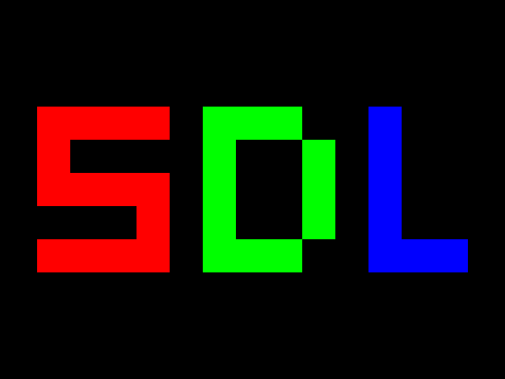
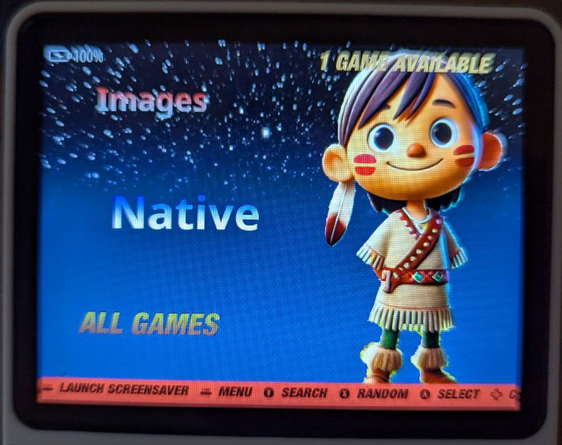

# Author

Dov Grobgeld
<dov.grobgeld@gmail.com>
Last edited: 2024-09-10 Tue

# License

All files in this repository are licensed under the following BSD License. See 

# Intro

The R36S is a very powerful little handheld computer, that comes with the Linux based ArkOS Open Source operating system preinstalled. The system is built with emulation in mind, but as it is a standard Linux based system, it is quite straightforward to write native programs and games for it.

This repo will explore what is needed to program the system in C. Note that in addition, you can use almost any program that Linux supports and which has SDL bindings. E.g. C++, python, and zig.

# Connecting

In order to program the R36S you first need to connect to it from your computer by carrying out the folloiwing steps.

1. Connect Wifi dongle to the right hand usb port
2. Navigate through EmulationStation (ES) to Options, and connect to your local Wifi, by choosing your SSID and entering your password.
3. In the Options menu, choose "Enable remote services". This will only be needed the first time, as we will turn on this permanently. (See note about ssh connections below)
4. After succesfully connecting, check the IP address you connected to through Options->Network Info
5. On your PC, launch a ssh client and connect to the R36S
6. Login with user:ark password:ark

You now have a Linux shell on your R36S!

# ssh

SSH standands for "Secure SHell" and it is as standard way for unix-like systems to communicate. Once you have turned on the "remote service" option, your R36S is running the SSH daemon, and is ready for remote connections from any ssh client.

There are a large veriety of ssh clients available for different systems. Though in principle it is possible to connect a keyboard to the R36S and program it directly, it is much more convienient to use a "real computer" with a keyboard and connect by ssh. There are lots of ssh clients and tools that for various operating systems. 

Here is a list of some of them:

1. Command line ssh - This is the standard terminal connection
2. putty - A client for Windows system
3. termux - This is an android terminal emulator which contains an ssh client. If "all" you have is a android tablet with a keyboard, then you can use it to program the R36S.
4. Microsoft Visual Code - There are several clients available as extensions. This especially useful when you program on the R36S, and through the extension you can use edit remote files and then, compile and run your programs straight from the editor.
5. (emacs with tramp - This is what I use, but I have long ago stopped trying to persuade others to copy my old habits. :-) )

# Security and passwords

Note about security. By default ArkOS comes configured with default user/password ark/ark. Once you connect the first time you are strongly encouraged to change the password to something else by issuing the `passwd` command:

```
ark@rg351mp:~$ passwd
Changing password for ark.
Current password:
New password:
```
Note that when you are typing passwords at the shell, **there is no echo**, so you won't see neither the password you type nor any placeholders like "*".

## SSH keys

In addition to password based authentication, ssh allows public key based authentication, which will allow you to connect without needing to type your password. Describing how to set that up, is beyond the scope of this tutorial.

## scp

Scp stands for secure copy. It is convenient if you are editing the source files of your programs on your desktop and you can then copy them over to the R36S before you compile.

```
scp hello-sdl2.c r36s:git/r36s-programming/cprog/hello-sdl2/
```

# Git

git is a version control system. It is not strictly necessary for programming the R36S, but you do not want to work without it. It will allow you to backup and do source control of the program that you develop, and will also provide a convenient way of syncing the programs that you develop, between your R36S system and yor desktop.

# Preparing the system

Once you have connected the first time by your are working at the Linux prompt. We are now able to modify and setup the system to make it suitable for programming, initially for C and C++ . 

Here are the steps that you need to do:

1. Automatically allow ssh connections without needing to turn it on through the ES menu:

```
sudo systemctl enable sshd
```
2. Setup C and C++ environment. The arkos system comes with some of the system packages crippled, e.g. they are missing header files needed for C-compilation. The following command rectifies this as well as sets up additional system development packages that we need:
```
sudo apt-get install --reinstall libc6-dev libsdl2-dev linux-libc-dev g++ libstdc++-9-dev libsdl2-ttf-dev git python3 ninja-build cmake make python3
```

3. We are now ready to compile our first C-program. To do so, first clone this repository by git
```
mkdir git && cd git
git clone http://github.com/dov/r36s-programming
```

4. You can now compile your first program from the command line

```
cd cprog/hello-world
mkdir build && cd build && cmake -GNinja ..
ninja
./hello-world
```

This program writes "Hello world" to the console and quits.

5. If you are using Visual Studio Code on your host computer, install the "Remote - SSH" extension from the Visual Studio Market place. The first time you connect, visual studio will dowload the VS Code Server, and it will then allow you to edit files on the R36S. 

(I tried installing the Microsoft C/C++ extension. However, I could not get this to work. I'd be happy if someone can explore this further).

# Graphics by SDL2

Our first hello world program was a command line program. But to write games, we want to have graphics. The R36S supports the standard graphics library SDL2. We can test compiling a SDL2 based c-program as follows:

```
cd ~/git/r36-programming/cprog/hello-sdl2
mkdir build && cd build && cmake -GNinja ..
ninja
./hello-sdl2
```

This worked, somehow, but our program "collides" with the use of the screen by ES, because our program and ES are both running at the same time.

To fix this we can exit emulator system by Menu→Quit→Quit Emulationstation. This will turn the EmulationStation off, until next time you reboot the R36S.

If we now rerun ./hello-sdl2, we get only our colorful SDL on the screen:



# SDL2 specifics for the R36S

Even though the R36S is using a standard SDL, there are a few specifics that you need to be aware of:

1. The screen is 640x480 pixels. This is the only resolution that you can use.
2. All the input controls are mapped as joystick buttons and axes. You can read the state of the joystick by the standard SDL2 joystick functions. In order to use the joystick you need to open it as follows in C:

```
	// Initialize SDL before everything else, so other SDL libraries can be safely initialized
	if( SDL_Init( SDL_INIT_VIDEO | SDL_INIT_JOYSTICK ) < 0 ) {
		printf("Error : failed to initialize SDL (%s).\n", SDL_GetError());
		return EXIT_FAILURE;
	}

	// Check for joysticks
	if (SDL_NumJoysticks() < 1) {
		printf( "Warning: No joysticks connected!\n" );
		return EXIT_FAILURE;
	}
	else {
		// Load joystick
		gGameController = SDL_JoystickOpen( 0 );
		if (gGameController == NULL) {
			printf( "Warning: Unable to open game controller! SDL Error: %s\n", SDL_GetError() );
			return EXIT_FAILURE;
		}
	}

```

Once this is done, you can read the state of the joystick by the standard SDL2 joystick functions:

```
	while (SDL_PollEvent(&Event)) {
        switch (Event.type) {
            case SDL_JOYAXISMOTION:
                printf("axis = %d value = %d\n", 
                       Event.jaxis.axis, Event.jaxis.value);
                // Handle Joystick Motion
                break;
            case SDL_JOYBUTTONDOWN:
                printf("JoyButtonDown %d\n", Event.jbutton.button);
                break;
            case SDL_JOYBUTTONUP:
                printf("JoyButtonUp %d\n", Event.jbutton.button);
                break;
        }
    }
```

# Mapping of the R36S controls

The following table show the mapping of the joystick buttons and axes to the R36S controls:

| Joy-Button | Description |
|------------|-------------|
| 0          | B           |
| 1          | A           |
| 2          | X           |
| 3          | Y           |
| 4          | L1          |
| 5          | R1          |
| 6          | L2          |
| 7          | R2          |
| 8          | D-Up        |
| 9          | D-Down      |
| 10         | D-Left      |
| 11         | D-Right     |
| 12         | Select      |
| 13         | Start       |
| 16         | Fn          |

The axes are mapped as follows:

| Joy-Axis | Description                        |
|----------|------------------------------------|
| 0        | Left joystick - Left-Right motion  |
| 1        | Left joystick - Up-Down motion     |
| 2        | Right joystick - Left-Right motion |
| 3        | Right joystick - Up-Down motion    |

The program `print-joystick` will print the axes and buttons of the joystick to the console.

Press Fn+Start to exit the program.

# Installing into EmulationStation

It is possible to setup EmulationStation to support our native games. This is done by modifying the following files:

* `/etc/emulationstation/es_systems.cfg` - This file contains a list of our "emulators". We will add a new system "native" to this file.
* `/etc/emulationstation/themes/es-theme-nes-box/` - Contains themes for the various emulators. We want to add a theme for our "native" system. If you are using another theme, you will want to modify the destination.

To simplify this, enter the `scripts` sub directery of this repository and run the script `install-native-emulator.sh` as follows:

```
cd ~/git/r36-programming/scripts
python3 install-native-emulator.py
```

By default this script will reboot the R36S at the end. You may change this behavior, and other defaults, by setting the command line argument.

If all goes well you will now have a native menu in emulator station:



And if you enter it, you will see the c++ sdl program listed as a "game".


## Note about theme

The "native" theme images were created by me and are free to use and copy.

# Final thoughts

First of all, this repository, and this article is work in progress. I hope to expand it as time allows.

However, my intention was not to teach "everything". There are lots of material available on the net about Linux, SDL, git, game programming, and more. My intent was to try to put these into perspective with regards to the R36S.

Please let me know your feedback and comments!


